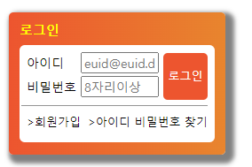

## Mission-02

- [General info](#general-info)
- [Results](#results)
- [Description](#description)

## General info

피그마로 주어진 Web Cafe 시안의 일부를 구현한 결과물입니다.

## Results

1. login창 만들기



## Description

- login:
  h1태그 안에 로그인 이라는 제목을 넣고 진행 하였습니다.
  section 태그를 만들어 form태그를 감싸 주었고 label과 input태그는 또다른 부모의 div로 감싸고 진행 하였습니다. 다음으로 button태그를 만들고 fieldset태그를 닫아 주었습니다.
  span태그를 만들어 밑줄처리를 하였고 ul태그를 감싼 a태그로 마무리 하였습니다.
```
- 일부 요소의 배치를 position 속성을 활용하여 구현한다.
- 회원가입, 아이디/비밀번호 찾기 영역은 float을 활용하여 구현한다.
```
```
main포지션에 relative를 주고 button태그에 position:absolute를 주었습니다.
회원가입 부분은 각자 li태그에 class를 주어 left,right를 주고 상하는 padding을 주어 정렬했습니다.

```

```
main
│
h1
│
├──로그인
section
├── form
└── fieldset
 │  legend
 └──├── div
    │    ├── div
    │    │    ├── label
    │    │    └── input
    │    │  
    │    └── div
    │         ├── label
    │         └── input
    ├── button
    ├── span
    │
    ├── ul
    │   ├── li─a
    │   ├── li─a
    │    
```
```

```