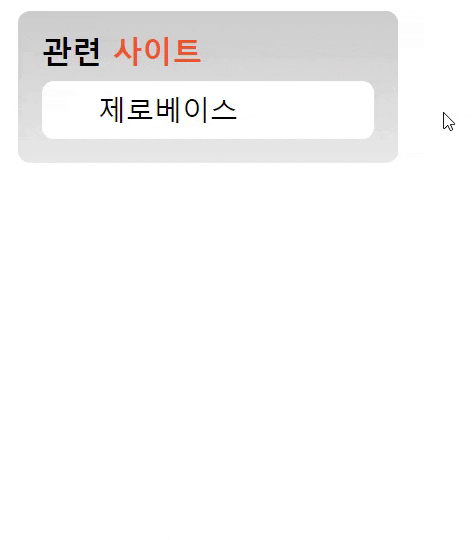

## Mission-03

- [Results](#results)
- [Description](#description)

## Results

1. 애니메이션 만들기



## Description

- :
section 태그를 주어 구분 하였고 메뉴부분은 li*5로 5개를 만들었습니다.
  
```
html
├─ head  
└─ body
   └─ main
      └─section 
       ├─ h1 
       │  └─ span
       │       
       └─ nav
          └─ ul
             ├─ li
             │  └─ a href="/" 
             ├─ li
             │  └─ a href="/" 
             ├─ li
             │  └─ a href="/" 
             ├─ li
             │  └─ a href="/" 
             └─ li
                └─ a href="/" 
 ```
 ```
 과제내용
 - 목록에 마우스를 올리면 5개의 목록이 펼쳐지도록 구현한다.
 - transition 속성을 활용하여 애니메이션 효과를 적용한다.
 ```
 ```
 first li 요소를 제외한 나머지 요소는 overflow로 숨김 처리를 하였고 hover속성을 활용하여 메뉴가 나타나게 설계하였습니다. 
 transition속성은 ul태그와 li이 태그에게 각각 설정 하였습니다.
 hover를 하였을때 변화가 있는 부분은 hover를 li에 주어서 transform: translateY속성을 사용 하였습니다.
 ```

