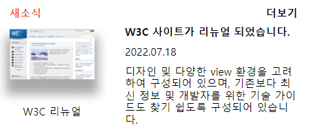

## Mission-04

- [Results](#results)
- [Description](#description)

## Results

1. grid로 배치하기



## Description

- :
div태그로 전체를 감싸고 이미지부분과 단락부분을 구분하였습니다.
  
```
html
├─ head  
└─ body
   └─ main
      └─div 
       ├─ h2 
       │  └─div
       │       
       ├─ div
       │  └─div
       │  └─ img
       │      └─ p
       │   
       └─ div
           └─p*3

 ```
 ```
 과제내용
 - grid를 활용하여 레이아웃을 구현한다.
 ```
 ```
 grid 속성을 전체 태그에 주고 배치를 하였고 img태그는 margin-left를 -로 주어서 1열에 붙였습니다.
 총 4개의 열을 주고 p단락부분은 영역을 매핑해서 구획 하였습니다. 
 ```
